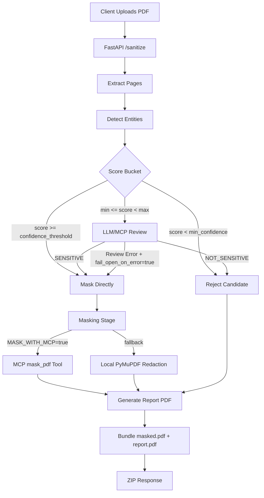

# Architecture Diagram

## Notes

- NLP detection backend: Presidio + spaCy `en_core_web_lg`
- Borderline candidates are reviewed using OpenAI (direct or via MCP)
- Report includes direct-threshold and LLM/MCP review outcomes
